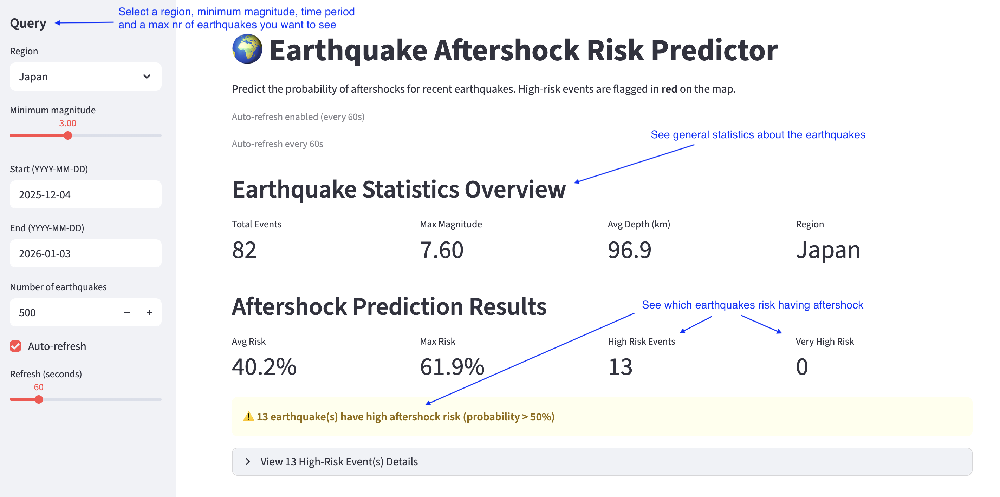
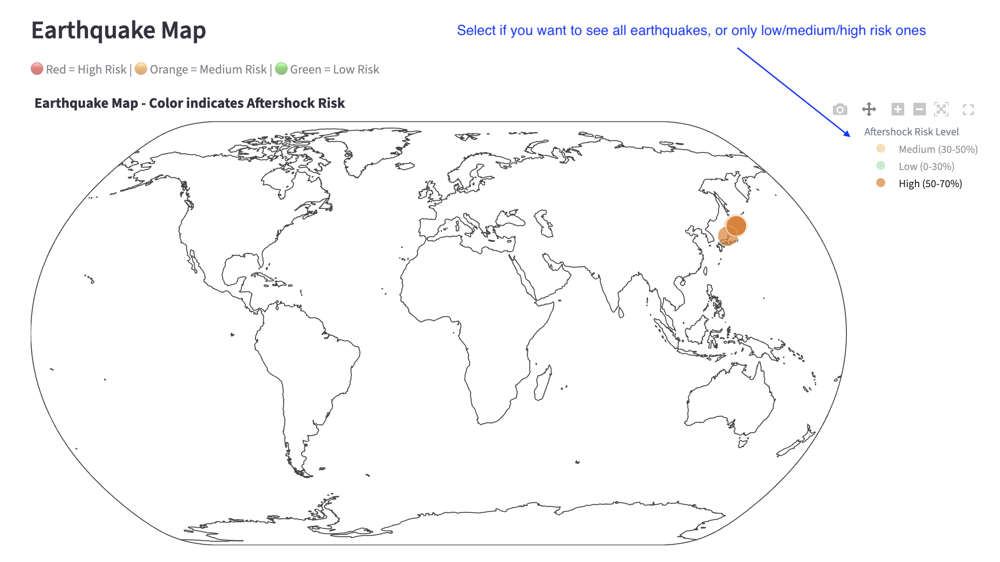

# 🌍 Earthquake Aftershock Risk Predictor

A machine learning application that predicts the probability of aftershocks for recent earthquakes. The app uses a trained logistic regression model to analyze earthquake data and flag high-risk events that are likely to trigger aftershocks.



## 🎯 Purpose

**Main Goal:** Identify earthquakes with high risk of aftershocks to help with early warning and risk assessment.

The app:
- Fetches recent earthquake data from the USGS API
- Uses a trained ML model to predict aftershock probability for each earthquake
- **Visualizes risk on an interactive map** (red = high risk, green = low risk)
- **Flags high-risk events** with warnings and detailed information

## 🏗️ How It Works

1. **Data Collection**: The app fetches earthquake data from USGS based on user-selected region and time period
2. **Feature Engineering**: Extracts features like magnitude, depth, time since previous earthquake, distance to previous earthquake, and rolling counts
3. **Prediction**: Uses a pre-trained logistic regression model to predict the probability of aftershocks
4. **Visualization**: Displays earthquakes on a map color-coded by risk level:
   - 🔴 **Red** = Very High Risk (70-100% probability)
   - 🟠 **Orange** = High Risk (50-70% probability)
   - 🟡 **Yellow** = Medium Risk (30-50% probability)
   - 🟢 **Green** = Low Risk (0-30% probability)
5. **Risk Warnings**: Automatically flags and displays details for earthquakes with >50% aftershock probability



## 📁 Project Structure

* `app.py` - Main Streamlit application (user interface)
* `src/usgs_client.py` - Fetches earthquake data from USGS API
* `src/features.py` - Feature engineering (time features, sequence features, statistics)
* `src/labels.py` - Creates aftershock labels (y=1 if aftershock occurs within T hours and R km)
* `src/models.py` - ML model training and prediction functions
* `src/viz.py` - Visualizations (maps, charts, plots)
* `src/hopsworks_client.py` - Hopsworks integration (Feature Store & Model Registry)
* `scripts/train_model.py` - Script to train and save the ML model

## 🚀 Setup

### 1. Install Dependencies

```bash
# Create and activate virtual environment (Python 3.12 recommended)
python3.12 -m venv venv
source venv/bin/activate  # On Windows: venv\Scripts\activate

# Install packages
pip install -r requirements.txt
```

### 2. Configure Hopsworks

Create a `.env` file in the project root:

```bash
HOPSWORKS_API_KEY=your_api_key_here
```

Get your API key from [Hopsworks Serverless](https://c.app.hopsworks.ai)

## 📖 Usage

### Running the Application

```bash
streamlit run app.py
```

The app will:
1. ✅ Load the trained model from Hopsworks Model Registry
2. ✅ Fetch earthquake data based on your selections (region, time period, magnitude)
3. ✅ Generate predictions for each earthquake
4. ✅ Display results on an interactive map with risk color-coding
5. ✅ Show warnings for high-risk events
6. ✅ Save new data to Hopsworks Feature Store for future model retraining

### Collecting Training Data

**Recommended: Use the automated data collection script** to gather 10,000+ samples:

```bash
python scripts/collect_training_data.py
```

This script will:
- Automatically collect data from multiple regions (Japan, Mexico, Chile, California, Indonesia, Global)
- Collect data from the last 2 years in 90-day chunks
- Save data to Hopsworks Feature Store as it collects
- Target: 10,000+ samples for a robust model

**Alternative: Manual collection via Streamlit app:**
1. In the Streamlit app, set:
   - **Number of earthquakes**: 1000+ (maximum)
   - **Time span**: 90+ days (or longer)
   - Run the app multiple times with different date ranges
   - Try different regions to get diverse data

2. Each time you run the app, data is saved to Hopsworks Feature Store

### Training a New Model

**After collecting data**, train the model:

```bash
python scripts/train_model.py
```

**⚠️ Important - Data Requirements:**
- **Minimum recommended: 2000+ samples** for a trustworthy model
- **Better: 5000+ samples** for more reliable predictions
- **Best: 10,000+ samples** for production-ready model
- The model needs at least 20 positive labels (aftershocks) to train

This script:
1. Loads all historical data from Hopsworks Feature Store
2. Warns if dataset is too small (< 2000 samples)
3. Trains a logistic regression model
4. Evaluates model performance (AUC, classification report)
5. Saves the model to Hopsworks Model Registry

**Note:** The model only needs to be trained once (or when you want to retrain with new data). After training, the Streamlit app will automatically load and use the model.

## 🔧 How the Model Works

The model uses **Logistic Regression** to predict aftershock probability based on:

- **Magnitude** - Earthquake magnitude
- **Depth** - Earthquake depth (km)
- **Time since previous** - Hours since the last earthquake
- **Distance to previous** - Kilometers from the previous earthquake
- **Rolling counts** - Number of earthquakes in the last 6h and 24h

**Label Definition:** An earthquake is labeled as having an aftershock (y=1) if another earthquake occurs within:
- **T hours** (default: 24 hours)
- **R kilometers** (default: 100 km)

## 🗄️ Hopsworks Integration

This project uses Hopsworks for:

- **Feature Store**: 
  - Centralized storage of all earthquake features and labels
  - Enables reproducible model training with historical data
  - Versioned feature groups for data lineage

- **Model Registry**: 
  - Versioned storage of trained models
  - Automatic model loading in the app
  - Model metrics tracking (AUC, sample counts, etc.)

All Hopsworks functionality is cleanly separated in `src/hopsworks_client.py`.

## 📊 Understanding the Results

The application provides a comprehensive dashboard with real-time earthquake data and risk predictions:

- **Query Parameters** (Left Sidebar):
  - Select region (Global, Japan, California, etc.)
  - Set minimum magnitude threshold
  - Choose date range for data collection
  - Configure number of earthquakes to analyze
  - Enable auto-refresh for continuous monitoring

- **Statistics Overview**:
  - Total events found
  - Maximum magnitude
  - Average depth
  - Selected region

- **Prediction Results**:
  - Average risk across all events
  - Maximum risk (highest risk event)
  - Count of high-risk events (>50% probability)
  - Count of very high-risk events (>70% probability)

- **Map Colors**: 
  - Red dots = High aftershock risk (be cautious!)
  - Orange dots = Medium-High risk
  - Green dots = Low aftershock risk
  
- **Risk Warnings**: 
  - Events with >50% probability are flagged with warnings
  - Events with >70% probability show error-level alerts
  - Click to expand for detailed information

- **Metrics**: 
  - Average probability across all events
  - Maximum probability (highest risk event)
  - Count of high-risk events

## 🔄 Workflow

1. **Initial Setup**: Train model once with `scripts/train_model.py`
2. **Daily Use**: Run `streamlit run app.py` to:
   - View recent earthquakes
   - See risk predictions
   - Identify high-risk events
3. **Data Collection**: App automatically saves new data to Hopsworks
4. **Periodic Retraining**: Retrain model when you have enough new data

## 📝 Notes

### Data Requirements

- **Minimum for training**: 20 positive labels (aftershocks)
- **Recommended for reliable model**: 2000+ total samples
- **Better for production**: 5000+ samples
- **Why more data matters**: 
  - Reduces overfitting
  - Better generalization to new earthquakes
  - More stable predictions
  - Better handling of edge cases

### Collecting More Data

To build a better dataset:
1. **Increase time span**: Use 90-180 days instead of 7 days
2. **Increase earthquake limit**: Use 1000+ earthquakes per query
3. **Multiple queries**: Run the app with different date ranges
4. **Different regions**: Collect data from various earthquake-prone areas
5. **Historical data**: Query older earthquakes (USGS has data going back years)

### Model Quality

- Model predictions are probabilities (0-100%), not certainties
- High-risk events should be monitored but predictions are not guarantees
- A model trained on 500 samples may work but will be less reliable than one trained on 2000+ samples
- The training script will warn you if your dataset is too small